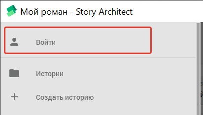
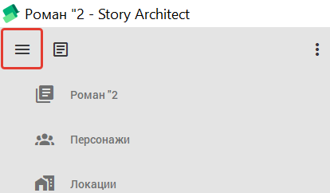
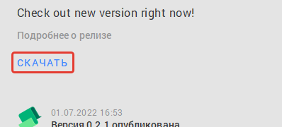

# **Инструкция по работе и настройке сервиса Story Architect**

[Инструкция по работе и настройке сервиса Story Architect](#инструкция-по-работе-и-настройке-сервиса-story-architect)

[Как начать работу?](#как-начать-работу)

[Установка программы на Windows](#установка-программы-на-windows)

[Установка программы на MacOS](#установка-программы-на-macos)

[Установка программы на Linux](#установка-программы-на-linux)

[Установка программы на Chrome OS](#установка-программы-на-chrome-os)

[Первый запуск](#первый-запуск)

[Регистрация](#регистрация)

[Прохождение регистрации](#прохождение-регистрации)

[Функционал личного кабинета](#функционал-личного-кабинета)

[Создание Истории](#создание-истории)

[Создание папки](#создание-папки)

[Функции папки](#функции-папки)

[Создание Текста](#создание-текста)

[Перемещение текстового файла](#перемещение-текстового-файла)

[Настройки текста](#настройки-текста)

[Поиск по тексту и навигация](#поиск-по-тексту-и-навигация)

[Поиск по тексту](#поиск-по-тексту)

[Навигация](#навигация)

[Корректировка текста](#корректировка-текста)

[Закладка](#закладка)

[Создание своего стиля](#создание-своего-стиля)

[Параметры редактора стиля](#параметры-редактора-стиля)

[Параметры страниц шаблона](#параметры-страниц-шаблона)

[Параметры стилей параграфов шаблона](#параметры-стилей-параграфов-шаблона)

[Создание персонажа](#создание-персонажа)

[Создание персонажа](#создание-персонажа)

[Настройка персонажа](#настройка-персонажа)

[Редактор отношений персонажа](#редактор-отношений-персонажа)

[Настройки отношений персонажа](#настройки-отношений-персонажа)

[Создание отношений между персонажами](#создание-отношений-между-персонажами)

[Настройка отношений между персонажами](#настройка-отношений-между-персонажами)

[Создание локации](#создание-локации)

[Создание локации](#создание-локации)

[Настройка локации](#настройка-локации)

[Редактор локации](#редактор-локации)

[Настройки маршрутов между локациями](#настройки-маршрутов-между-локациями)

[Создание маршрутов между локациями](#создание-маршрутов-между-локациями)

[Создание сценария](#создание-сценария)

[Создание сценария](#создание-сценария)

[Настройка сценария](#настройка-сценария)

[Создание логлайна](#создание-логлайна)

[Создание текста сценария](#создание-текста-сценария)

[Расположение функций редактора:](#расположение-функций-редактора)

[Поиск по тексту и навигация](#поиск-по-тексту-и-навигация)

[Поиск по тексту](#поиск-по-тексту)

[Навигация](#навигация)

[Корректировка текста](#корректировка-текста)

[Закладка](#закладка)

[Статистика](#статистика)

[Создание комикса](#создание-комикса)

[Создание комикса](#создание-комикса)

[Настройка комикса](#настройка-комикса)

[Создание логлайна](#создание-логлайна)

[Создание текста комикса](#создание-текста-комикса)

[Расположение функций редактора:](#расположение-функций-редактора)

[Поиск по тексту и навигация](#поиск-по-тексту-и-навигация)

[Поиск по тексту](#поиск-по-тексту)

[Навигация](#навигация)

[Корректировка текста](#корректировка-текста)

[Закладка](#закладка)

[Статистика](#статистика)

[Создание аудио постановки или подкаста](#создание-аудио-постановки-или-подкаста)

[Настройка аудио постановки](#настройка-аудио-постановки)

[Создание логлайна](#создание-логлайна)

[Создание текста аудиопостановки](#создание-текста-аудиопостановки)

[Расположение функций редактора:](#расположение-функций-редактора)

[Поиск по тексту и навигация](#поиск-по-тексту-и-навигация)

[Поиск по тексту](#поиск-по-тексту)

[Навигация](#навигация)

[Корректировка текста](#корректировка-текста)

[Закладка](#закладка)

[Статистика](#статистика)

[Создание пьесы](#создание-пьесы)

[Создание пьесы](#создание-пьесы)

[Настройка пьесы](#настройка-пьесы)

[Создание логлайна](#создание-логлайна)

[Создание текста пьесы](#создание-текста-пьесы)

[Расположение функций редактора:](#расположение-функций-редактора)

[Поиск по тексту и навигация](#поиск-по-тексту-и-навигация)

[Поиск по тексту](#поиск-по-тексту)

[Навигация](#навигация)

[Корректировка текста](#корректировка-текста)

[Закладка](#закладка)

[Статистика](#статистика)

[Корзина](#корзина)

[Настройки](#настройки)

[Настройки вызываемого меню (список слева)](#настройки-вызываемого-меню-список-слева)

[Настройки программы](#настройки-программы)

[Компоненты](#компоненты)

[Текстовый модуль](#текстовый-модуль)

[Создание собственного стиля](#создание-собственного-стиля)

[Параметры редактора стиля](#параметры-редактора-стиля)

[Параметры страниц шаблона](#параметры-страниц-шаблона)

[Параметры стилей параграфов шаблона](#параметры-стилей-параграфов-шаблона)

[Сценарный модуль](#сценарный-модуль)

[Комиксовый модуль](#комиксовый-модуль)

[Аудиопостановочный модуль](#аудиопостановочный-модуль)

[Пьесовый модуль](#пьесовый-модуль)

[Горячие клавиши](#горячие-клавиши)

##
## Как начать работу?
### Установка программы на Windows
- Зайдите на сайт <https://starc.app/ru/download>
- Перейдите в раздел Скачать

- Пролистайте страницу вниз до списка поддерживаемых систем
- Выберите вашу систему из предложенных вариантов (Windows):

- После нажатия начнется загрузка файла установки
- Откройте файл установки
- Следуйте рекомендациям по установке
- После завершения установки откройте программу
### Установка программы на MacOS
- Зайдите на сайт <https://starc.app/ru/download>
- Перейдите в раздел Скачать

- Пролистайте страницу вниз до списка поддерживаемых систем
- Выберите вашу систему из предложенных вариантов (MAC OS X):

- Дважды нажмите на скачанный файл и монтируйте образ диска
- Перетяните приложение (расширение .app) в папку «Программы»
- Скопируйте скачанный файл в папку «Программы» на вашем жестком диске
- Дождитесь завершения процесса копирования
### Установка программы на Linux
- Зайдите на сайт <https://starc.app/ru/download>
- Перейдите в раздел Скачать

- Пролистайте страницу вниз до списка поддерживаемых систем
- Выберите вашу систему из предложенных вариантов (Linux):

Установка через графический интерфейс:

- Откройте свойства файла
- Перейдите на вкладку «Права»
- Установите флаг напротив строки «Разрешить выполнение файла как программы»

Установка через терминал:

- Перенесите скачанный файл в папку: ~/Applications/ или ~/.local/bin/ или ~/bin/
- Создайте ярлык и разместите в папке: ~/.local/share/applications/
### Установка программы на Chrome OS
- Зайдите на сайт <https://starc.app/ru/download>
- Перейдите в раздел Скачать

- Пролистайте страницу вниз до списка поддерживаемых систем
- Выберите вашу систему из предложенных вариантов (Linux):

- Установите файловый менеджер для Linux – рекомендуем nautilus
- Сделать это можно выполнив команду в терминале: sudo apt-get install nautilus
- После установки в панели запуска Chrome OS найдите папку приложений Linux.
- В нем находится приложение «Файлы»
- Перенесите скачанный файл программы в раздел «Файлы Linux»
- Откройте приложение Linux files (Nautilus) и нажмите на файле программы правой кнопкой мыши, выберите в меню пункт Опции (Properties)
- Перейдите во вкладку «Разрешения» (Permissions) и установите флажок «Выполнить» (Execute)
- Дважды кликните на файл программы с разрешением AppImage
### Первый запуск
- Первый запуск программы предложит выбор:

- Выберите язык работы нажав на кружок напротив вашего языка
- Нажмите продолжить:

- Далее откроется окно настроек темы приложения и размера элементов управления:
  - По умолчанию доступны 3 темы:
    - Светлая – выполнена в светлых тонах
    - Смешанная – делит функционал на светлую и темную часть
    - Темная – выполнена в темных тонах
  - Кликните на удобную для вас:

- Бегунок размеров элементов управления:
  - При перемещении точки по линии вы можете увеличивать или уменьшать элементы управления сервисом.

- Нажмите «продолжить»
### Регистрация
Прохождение регистрации открывает доступ к дополнительному функционалу, а также приобрести платную версию

С дополнительным функционалом вы можете ознакомиться:

<https://starc.app/pricing>
#### *Прохождение регистрации*
- Нажмите на кнопку бокового меню в левом верхнем углу программы:

- Нажмите войти:

- Введите вашу электронную почту:

- Нажмите кнопку «Войти»
- Введите код подтверждения, который отправлен на указанную почту:

- После ввода кода произойдет автоматическая авторизация и ваш аккаунт будет залогинен (появится аватар в левом меню и указана почта)
#### *Функционал личного кабинета*
Для перехода в личный кабинет:

- Откройте левое меню нажав:

- Нажмите на аватар пользователя или на имя

Функционал содержит:

- Поле ввода, которое содержит ваше имя и его можно изменять по желанию
- Информацию о вас
- Флаг «Хочу получить новости проекта» - на указанный вами при регистрации почтовый ящик будет приходить информация об обновлении программы.
- Окно добавления аватара:
  - Нажмите на область «Добавить аватар+»
  - Или вставьте скопированное в буфер обмена изображение
- Раздел текущего тарифа (по умолчанию Free версия), где вы можете изменить текущий тариф, содержащий больше полезных функций
  - Получите пробный период нажав «Попробовать PRO бесплатно» и подтвердив всплывающее уведомление
  - Приобретите PRO версию нажав «Обновить до PRO» и проследовав инструкции
- Поле ввода «Промо или подарочный код» - это поле для промокодов:
  - Введите код
  - Нажмите «Активировать»
- Активные сессии – содержит информацию обо всех устройствах, на которых в текущий момент запущена программа и авторизован ваш E-mail
- Кнопка «Выйти» в левом нижнем углу выйдет из вашего зарегистрированного E-mail
### Создание Истории
История – это файл, в котором хранятся все созданные вами папки и документы по одному проекту.

Проект – это созданная вами директория (место хранения), которая содержит все подразделы и документы.

Создать историю:

- Нажмите на одну из кнопок указанную на скриншоте:

- Установите «Тип истории» по желанию, можно оставить «Не установлен»:
  - Нажмите на поле «Тип истории»
  - Выберите из выпадающего списка подходящий вариант
- Введите название истории в поле «Название истории»
- Нажмите кнопку «Создать»:

- Шестеренка в левом нижнем углу – настройки:
  - Указание, где будет храниться файл с вашей историей
  - Выбрать файл на компьютере, если у вас уже есть созданная история:
    - Нажмите иконку папки в правой части
    - Выберите файл на устройстве

- После создания отроется окно работы с проектом:

- В левом столбце можете увидеть все документы вашего произведения
- В правой рабочей области указать название, краткое описание, добавить обложку.
## Создание папки
Папка – это место для хранения созданных текстов и других частей истории.

Создание папки:

- Правой клавишей нажмите на поле слева
- Нажмите «добавить папку»
- Или «Добавить документ» внизу левого столбца

- Введите название папки и нажмите «Создать»

- В левом списке документов отобразится созданная вами папка:

### Функции папки
В папку можно перетянуть документ из списка, и он будет находиться в ней:

- Зажмите левую клавишу мыши на документе и перетяните его в папку. Слева от папки с файлами отобразится стрелка, которая позволяет просмотреть список документов, находящихся в данной папке. Чтобы развернуть или скрыть список файлов нажмите на стрелку:

Папка имеет встроенный текстовый документ, в котором можно также вести записи и добавлять заголовки:

- Нажмите на поле названия и начните вводить текст
- Для создания заголовков выделите текст и в верхнем выпадающем меню выберите подходящий заголовок:

## Создание Текста
Текст – это документ, в котором хранятся ваши записи внутри проекта.

`	`Создать текст:

- Нажмите на левом поле, где находится список файлов проекта правой клавишей мыши
- Нажмите «добавить документ» или нажмите на «Добавить документ» внизу списка:

- Нажмите «Текст» в левом списке и введите название
- Нажмите «Создать»

После создания документ отобразится в списке слева.

Название вашего документа – это первая строка в файле. Для изменения ее замените первую строку документа.
### Перемещение текстового файла
Данная опция позволит переместить файлы в папки или изменить очередность файлов внутри одной истории.

Файл документа можно перемещать по дереву проекта перетягивая:

- Захватите левой кнопкой мыши документ, который хотите перенести
- Перетащите на новое место
### Настройки текста
В данном разделе описан весь функционал для работы с текстовым документом.

- В верхней части документа расположен редактор, который содержит:
  - Стрелки влево и вправо – это отмена действия или вернуть отмененное действие, доступно несколько раз подряд
  - «Текст» - это изменить формат текста на заголовки разного уровня или добавить заметку
  - Панель быстрого форматирования – открывает в правой части экрана меню с возможностью изменения заголовков.
  - Поиск по тексту – позволяет найти и заменить в текущем документе слова или предложения. (Просмотр опций в разделе «[Поиск по тексту и навигация](#поиск-по-тексту)»)
  - Включить режим редактирования – открывает дополнительное меню для корректировки текста. (Просмотр опций в разделе «[Корректировка текста](#корректировка-текста)»)

#### *Поиск по тексту и навигация*
##### Поиск по тексту
Данная опция создана для поиска и замены названий, например, добавления заглавных букв к именам.

Для поиска:

- Нажмите на значок лупы в верхнем меню

Варианты поиска и опции:

1. Поле для ввода текста, который необходимо найти. Введите текст, нажмите Enter.
1. Листать найденные совпадения в тексте, следующее или предыдущее
1. Учитывать регистр при поиске. Будет ли найдено искомое слово, если оно будет написано заглавными или прописными буквами, в отличие от заданного запроса.
1. Поле для ввода текста, на который необходимо заменить искомый.
1. Заменяет найденный текст, который в текущий момент выделен
1. Заменяет все найденные в тексте совпадения на введенный текст.

##### Навигация
Навигация позволяет быстро перемещаться между главами и разделами в текстовом документе.

Для просмотра дерева документа нажмите:

- Стрелку справа от названия документа:

- Или дважды нажмите на название.

В меню оглавления (после перехода в дерево документа) есть возможность перемещать блоки перетягивая их на новое место. Вместе с оглавлением переместится и массив текста после заголовка.

Дерево документа – это расположение документов внутри файла и их взаимосвязь.
#### *Корректировка текста*
Для включения режима корректировки текста нажмите в верхнем меню на значок карандаша.

- Выделите необходимый для корректировки текст
- В правой части появится дополнительное меню:
  - Изменить цвет текста.
  - Изменить цвет выделения текста.
  - Добавить комментарий.
  - Выбрать цвет действия.

Порядок действий изменения цвета:

1. Выделите текст
1. Выберите цвет из палитры (4)
1. Нажмите на необходимое изменение (изменение цвета текста/заливка текста)

Порядок действий для написания комментария:

1. Выделите текст
1. Нажмите добавить комментарий (3)
1. В открывшемся поле напишите комментарий
1. Нажмите сохранить

Все опции для корректировки текста доступны также при нажатии правой клавиши мыши:

- Закладка – это отметка в тексте, которая содержит вашу запись, но не видна в тексте.
- Форматирование – выделите текст, нажмите правой клавишей на выбранной части текста, выберите необходимые параметры из раздела «Форматирование»
- Копировать, вырезать, вставить
- Выбрать весь текст
#### *Закладка*
- Для создания закладки нажмите правой клавишей мыши в месте, где хотите добавить закладку
- в выпадающем меню напротив «Закладка» выберите «Добавить»
- впишите в открывшемся окне текст закладки.
  - При создании закладки в правой части ввода текста можно выбрать цвет закладки: нажмите на кружок, выберите из палитры цвет.
  - Можно показать или скрыть список закладок: нажмите правую клавишу мыши и в разделе «Закладка» выберите пункт «Показать/скрыть список»
  - Если закладка уже создана на данной строке, то можно из опций ее редактировать. Клик правой клавишей на строке созданной ранее закладки> закладки> редактировать закладку

Для просмотра созданных закладок перейдите в правом меню в подраздел «Закладки», если данного раздела у вас нет, то:

- Правой клавишей в любом месте текста
- В разделе «Закладка» нажмите показать/скрыть список

#### *Создание своего стиля*
Создание своего стиля необходимо для написания документа в единой стилистике отличной от базовой (предложенной программой).

Вы можете выбрать из нескольких представленных вариантов, которые есть в базовом списке или создать личный стиль.

1. Откройте левое меню, нажав на три полосы в левой верхней части программы
1. Перейдите в раздел «[Параметры приложения](#настройки-программы)»
1. Пролистайте меню, до раздела Компоненты> Простой текст (Текстовый модуль)
1. Выберите из выпадающего списка предложенный вариант или нажмите на три точки (Опции) напротив строки «Редактор текста» для создания личного стиля

1. Нажмите «Дублировать», откроется окно создания стиля.
##### Параметры редактора стиля
###### Параметры страниц шаблона
В левом меню переключается отображение значений в миллиметрах или дюймах. Для выставления, подходящего нажмите на нужный формат.

Первая строка – название вашего собственного стиля.

Формат страницы – варианты ширины и высоты страницы. Для выбора нажмите на нужный вам вариант из списка.

Поля страницы – обозначают отступы слева, справа, сверху и снизу. Введите удобные вам значения.

Расположить номера страниц по вертикали и по горизонтали – место, где будут находится колонтитулы с отображением страницы. Для изменения нажмите на кружок напротив нужного вам расположения в списке вариантов.
###### Параметры стилей параграфов шаблона
Для перехода в раздел настройки параграфов нажмите в левом верхнем углу знак:

На данной странице вы сможете настроить формат текста:

- Формат шрифта – в выпадающем списке выберите подходящий
- Размер шрифта – высота шрифта, в выпадающем списке выберите подходящий
- Размещать параграф в начале страницы – нажмите на квадрат рядом с форматом для выбора необходимого
- Использовать заглавные буквы для текста параграфа – нажмите на квадрат рядом с форматом для выбора необходимого
- Формат текста (полужирный, курсив, подчеркнутый) – нажмите на квадрат рядом с форматом для выбора необходимого
- Расположить текст на странице – нажмите на круг рядом с форматом для выбора необходимого
- Установите отступы и интервалы
- Отображать или скрыть заголовок параграфа

Данная настройка доступна для всех заголовков, текста и заметок по тексту.

Для настройки текста перейдите в верхнем списке на необходимый уровень текста:

После завершения настройки нажмите значок дискеты в верхней части окна программы:

После сохранения в списке будет доступен созданный вами стиль.
## Создание персонажа
Персонаж – это карточка с информацией о будущем участнике вашего произведения.
### Создание персонажа
- Нажмите на левом поле, где находится список файлов проекта правой клавишей мыши
- Нажмите «Добавить документ» или нажмите на «Добавить документ» внизу списка:

- Нажмите «Персонаж» в левом списке и введите имя персонажа, если не можете придумать, то нажмите на значок игральных кубиков – это создание случайного имени
- Нажмите «Создать»

После создания персонаж отобразится в левом разделе, в списке «Персонажи».
### Настройка персонажа
Для перехода к настройкам нажмите на имя персонажа в списке слева:

Если список свернут, то нажмите на стрелку слева от «Персонажи», чтобы просмотреть весь список.

Настройки персонажа включают в себя информацию о герое истории:

- Название – имя персонажа.
- Кружочек справа от имени – выбор цвета: нажмите на кружок и выберите из палитры необходимый цвет.
- Роль в истории – выпадающий список с вариантами. Нажмите и выберите соответствующую вашему герою роль.
- Возраст – это возраст персонажа. Впишите значение буквами или цифрами.
- Пол – установите из выпадающего списка.
- Краткое и полное описания – это текстовые поля, которые вы можете заполнить по желанию.
- Добавить фото:
  - Нажмите левой клавишей на поле «Добавить фото +» и выберите с устройства
- Сгенерировать фото:
  - Если у вас нет подходящей фотографии, то нажмите правой клавишей на поле «Добавить фото+» и выберите «Сгенерировать»
  - После того, как изображение сгенерируется откроется новое окно, где можно изменить размеры изображения или выделить нужную часть изображения:
    - Потяните за уголки белой рамки. Данная рамка будет границами будущего изображения
    - Нажмите «Выбрать»

- Можно вставить изображение из буфера обмена:
  - Скопируйте изображение из другой программы
  - Нажмите правой клавишей на поле «Добавить фото+» и выберите «Вставить»
### Редактор отношений персонажа
Данный функционал является платным. Для работы в нем приобретите PRO-версию.

Он позволяет расположить на холсте персонажей и выстроить между ними отношения.

Нажмите на раздел «Персонажи» в левом списке:

#### *Настройки отношений персонажа*
Созданы для взаимосвязи между персонажами.

1. Создание нового персонажа – при нажатии откроется окно ввода имени и на поле появится новый персонаж.
1. Добавить папку (группу персонажей) – добавляет поле, в котором можно группировать персонажей путем перетягивания их в поле папки.
1. Кнопка удаления – удалит выбранного персонажа.
1. Показывать названия активных элементов – будет отображать взаимодействие персонажей только если их выделить нажатием. (Выделите персонажа нажав на него, и вы увидите только его взаимоотношения с другими героями).

В правом поле будет отображаться информация о выбранном элементе на холсте, где можно изменить цвет, название и описание.

Для персонажа:

- Фото
  - Добавить фото:
    - Нажмите левой клавишей на поле «Добавить фото +» и выберите с устройства
  - Сгенерировать фото:
    - Если у вас нет подходящей фотографии, то нажмите правой клавишей на поле «Добавить фото+» и выберите «Сгенерировать»
    - После того, как изображение сгенерируется откроется новое окно, где можно изменить размеры изображения или выделить нужную часть изображения:
      - Потяните за уголки белой рамки. Данная рамка будет границами будущего изображения
      - Нажмите «Выбрать»

- Можно вставить изображение из буфера обмена:
  - Скопируйте изображение из другой программы
  - Нажмите правой клавишей на поле «Добавить фото+» и выберите «Вставить»
- Имя
- Цвет персонажа – цветом будет выделено имя в списке слева, границы на холсте
- Роль – в зависимости от важности персонажа изображение на холсте будет больше или меньше
- Возраст
- Пол
- Краткое и полное описания

Для папки (группы):

- Тип рамки
- Цвет рамки
- Название
- Описание
##### Создание отношений между персонажами
Чтобы создать отношения между персонажами:

1. Нажмите и держите кнопку Alt на персонаже
1. Потяните на другого персонажа
1. Между ними образуется линия
##### Настройка отношений между персонажами
При нажатии на линию взаимоотношений из предыдущего пункта откроется настройка отношений:

- Тип линии – выбрать из выпадающего списка
- Кружок – это выбор цвета из палитры
- Точка зрения на взаимосвязь между персонажем 1 относительно персонажа 2
- Описание взаимосвязи
- Точка зрения на взаимосвязь между персонажем 2 относительно персонажа 1
- Описание взаимосвязи

После настройки взаимоотношений в меню справа сверху добавится вкладка «Отношения».

**Чтобы удалить взаимоотношение:**

- Выделите нажатием на него и нажмите значок «Корзина» в верхнем меню
- Выделите нажатием на него и нажмите кнопку del (delete) на клавиатуре

**Увеличить и уменьшить холст:**

- Зажмите ctrl и вращайте колесо мыши.
- Зажмите ctrl и нажмите кнопки + или - на клавиатуре чтобы приблизить или отдалить соответственно.

**Для MacOS:**

- Зажмите command и нажмите + или - на клавиатуре чтобы приблизить или отдалить соответственно.
- Жестом раздвинуть пальцами на тачпаде или совместить пальцы из разных концов тачпада.

**Передвигать холст**

- Зажмите колесо мыши и потяните
- Зажмите кнопку «Пробел» (Space) и потяните
## Создание локации
Данный раздел позволяет разработать место действия для будущей сцены.
### Создание локации
- Нажмите на левом поле, где находится список файлов проекта правой клавишей мыши
- Нажмите «Добавить документ» или нажмите на «Добавить документ» внизу списка:

- Нажмите «Локация» в левом списке и введите название локации
- Нажмите «Создать»

После создания локация отобразится в левом разделе.
### Настройка локации
Для перехода к настройкам нажмите на имя локацию в списке слева:

Если список свернут, то нажмите на стрелку слева от «Локации», чтобы просмотреть весь список.

Настройки локации включают в себя информацию о месте происходящей истории:

- Название – название места событий.
- Роль в истории – выпадающий список с вариантами. Нажмите и выберите соответствующую вашему герою роль.
- Краткое и полное описания – это текстовые поля, которые вы можете заполнить по желанию.
- Добавить фото:
  - Нажмите левой клавишей на поле «Добавить фото +» и выберите с устройства
- Можно вставить изображение из буфера обмена:
  - Скопируйте изображение из другой программы
  - Нажмите правой клавишей на поле «Добавить фото+» и выберите «Вставить»
### Редактор локации
Данный функционал является платным. Для работы в нем приобретите PRO-версию.

Он позволяет расположить на холсте локации и выстроить между ними маршруты.

Нажмите на раздел «Локации» в левом списке:

#### *Настройки маршрутов между локациями*
Создаются настраиваемые маршруты между локациями.

1. Создание новой локации– при нажатии откроется окно ввода названия и на поле появится новая локация.
1. Добавить папку (группу локаций) – добавляет поле, в котором можно группировать локации путем перетягивания их в поле папки.
1. Кнопка удаления – удалит выбранную локацию.
1. Показывать названия активных элементов – будет отображать маршруты между локациями только если их выделить нажатием. (Выделите локацию нажав на нее, и вы увидите только маршруты, в которых она задействована).

В правом поле будет отображаться информация о выбранном элементе на холсте, где можно изменить цвет, название и описание.

Для Локации:

- Фото
  - Добавить фото:
    - Нажмите левой клавишей на поле «Добавить фото +» и выберите с устройства
  - Можно вставить изображение из буфера обмена:
    - Скопируйте изображение из другой программы
    - Нажмите правой клавишей на поле «Добавить фото+» и выберите «Вставить»
- Название локации
- Цвет локации – цветом будет выделено название в списке слева, границы на холсте
- Роль – в зависимости от важности локации изображение на холсте будет больше или меньше
- Краткое и полное описания

Для папки (группы):

- Тип рамки
- Цвет рамки
- Название
- Описание
##### Создание маршрутов между локациями
Чтобы создать маршруты между локациями:

1. Нажмите и держите кнопку Alt на локации.
1. Потяните на другую локацию.
1. Между ними образуется линия.

**Задать название маршрута:**

- Нажмите на линию маршрута и укажите название в поле для ввода «Название».

**Задать описание маршрута:**

- Нажмите на линию маршрута и укажите описание в поле для ввода «Детали».

**Чтобы удалить маршрут:**

- Выделите нажатием на него и нажмите значок «Корзина» в верхнем меню
- Выделите нажатием на него и нажмите кнопку del (delete) на клавиатуре

**Увеличить и уменьшить холст:**

- Зажмите ctrl и вращайте колесо мыши.
- Зажмите ctrl и нажмите кнопки + или - на клавиатуре чтобы приблизить или отдалить соответственно.

**Для MacOS:**

- Зажмите command и нажмите + или - на клавиатуре чтобы приблизить или отдалить соответственно.
- Жестом раздвинуть пальцами на тачпаде или совместить пальцы из разных концов тачпада.

**Передвигать холст**

- Зажмите колесо мыши и потяните
- Зажмите кнопку «Пробел» (Space) и потяните
## Создание сценария
Сценарий – группирующий элемент, который объединяет в себе документы для создания сценария.
### Создание сценария
- Нажмите на левом поле, где находится список файлов проекта правой клавишей мыши
- Нажмите «Добавить документ» или нажмите на «Добавить документ» внизу списка:

- Нажмите «Сценарий» в левом списке и введите название сценария
- Нажмите «Создать»

После создания сценарий со всеми вложенными документами отобразится в левом разделе.
### Настройка сценария
Для перехода к настройкам нажмите на название сценария в списке слева:

Настройки сценария включают в себя информацию и настройки:

- Название сценария – имя документа.
- Тэглайн (также таглайн; англ. tagline) — краткая анонсирующая информация, в кинематографе и литературе — рекламный слоган, сопровождающий произведение.
- Логлайн – это очень краткое изложение драматической и логической сути сценария произведения, обычно объёмом одно-два предложения, до 25 слов. При этом целью такого рассказа является привлечь интерес слушателя к истории, чтобы он захотел ознакомиться со сценарием. В правой части поля для ввода содержит кнопку для создания полного логлайна.
- Титульная страница – заглавная страница произведения
- Синопсис — краткое линейное изложение концепции сценария произведения, его содержания, сути драматического конфликта в увлекательной форме. В синопсисе есть завязка, поворотные точки, кульминация, развязка. В отличие от логлайна, в синопсисе уже хорошо просматривается сценарная структура фильма.
- Поэпизодник - это эпизодное или (второй вариант) посценный план будущего фильма. Если синопсис соответствует финальной версии сценария на 70-80%, то поэпизодник соответствует финальной версии сценария примерно на 90%.
- Сценарий
- Статистика.

Элементы состава сценария можно удалять или добавлять, устанавливая галки напротив названия в настройке сценария.
### Создание логлайна
- Нажмите на иконку в меню настройки сценария
- Введите описание главного героя
- Укажите пол главного героя
- Нажмите продолжить
- Укажите событие, которое запускает основное действие истории
- Поставьте галку «Добавить тему/арку героя»
- В открывшемся поле введите что предстоит пройти герою
- Нажмите продолжить
- Укажите какова основная цель/действие истории
- Поставьте галку «Добавить поворотный момент»
- Укажите какое событие приводит персонажа к поворотному моменту
- Укажите какую цель приобретает главный герой при поворотном моменте
- Нажмите продолжить
- Поставьте галку «Происходит ли история в особом, будущем или магическом мире?»
- Укажите отличия мира от реального
- Нажмите продолжить
- Поставьте галку «Добавить ставки/дедлайн?»
- Укажите, что произойдет, если главный герой проиграет
- Нажмите продолжить

Система автоматически соберет ваш логлайн и укажет в соответствующем поле.

Установка всех галок является произвольной. Можно оставлять пустыми блоки логлайна и нажимать продолжить.
### Создание текста сценария
В данном разделе описан весь функционал для работы с текстовым документом для разделов:

- Синопсис
- Поэпизодник
- Сценарий

Отличия от текстового документа составляют:

В поэпиздонике:

- В верхнем меню заголовки заменены на:
  - Время и место
  - Участники сцены
  - Бит (Сценарный бит ("bit")) — это часть сценария или сцены (сцену так тоже удобно писать) включающий событие, влияющее на ход сценария или сцены. Событие ("как вдруг" по А.Митте) это действие, фраза, реакция на фразу, информация (поступившая тем или иным способом) и т.п. Составляют 8-10 битов на каждые 30мин. Часть из них — это основные поворотные точки истории.
  - Группа
  - Акт

В сценарии:

- В верхнем меню заголовки заменены на:
  - Время и место
  - Участники сцены
  - Описание действия
  - Персонаж
  - Ремарка
  - Реплика
  - Лирика
  - Кадр
  - Переход
  - Заметка по тексту
  - Простой текст
  - Группа
  - Акт
- Правый скроллбар (элемент для листания) разбит по временным этапам, для определения временных отрезков сцен.
#### *Расположение функций редактора:*
- В верхней части документа расположен редактор, который содержит:
1. Стрелки влево и вправо – это отмена действия или вернуть отмененное действие, доступно несколько раз подряд отменить или вернуть изменение
1. «Текст» - это изменить формат текста на заголовки разного уровня или добавить заметку
1. Панель быстрого форматирования – открывает в правой части экрана меню с возможностью изменения заголовков.
1. Поиск по тексту – позволяет найти и заменить в текущем документе слова или предложения. (Просмотр опций в разделе «[Поиск по тексту и навигация](#поиск-по-тексту)»)
1. Включить режим редактирования – открывает дополнительное меню для корректировки текста. (Просмотр опций в разделе «[Корректировка текста](#корректировка-текста)»)

#### *Поиск по тексту и навигация*
##### Поиск по тексту
Для поиска:

- Нажмите на значок лупы в верхнем меню

Варианты поиска и опции:

1. Поле для ввода текста, который необходимо найти. Введите текст, нажмите Enter.
1. Листать найденные совпадения в тексте, следующее или предыдущее
1. Учитывать регистр при поиске. Будет ли найдено искомое слово, если оно будет написано заглавными или прописными буквами, в отличие от заданного запроса.
1. Поле для ввода текста, на который необходимо заменить искомый.
1. Заменяет найденный текст, который в текущий момент выделен
1. Заменяет все найденные в тексте совпадения на введенный текст.

Данная опция удобна для поиска и замены названий, добавления заглавных букв к именам.
##### Навигация
Навигация позволяет быстро перемещаться между главами и разделами в текстовом документе.

Для просмотра дерева документа нажмите:

- Стрелку справа от названия документа:

- Или дважды нажмите на название.
#### *Корректировка текста*
Для включения режима корректировки текста нажмите в верхнем меню на значок карандаша.

- Выделите необходимый для корректировки текст
- В правой части появится дополнительное меню:
  - Изменить цвет текста.
  - Изменить цвет выделения текста.
  - Добавить комментарий.
  - Выбрать цвет действия.

Порядок действий изменения цвета:

1. Выделите текст
1. Выберите цвет из палитры (4)
1. Нажмите на необходимое изменение (изменение цвета текста/заливка текста)

Порядок действий для написания комментария:

1. Выделите текст
1. Нажмите добавить комментарий (3)
1. В открывшемся поле напишите комментарий
1. Нажмите сохранить

Все опции для корректировки текста доступны также при нажатии правой клавиши мыши:

- Закладка – это отметка в тексте, которая содержит вашу запись, но не видна в тексте.
- Форматирование – выделите текст, нажмите правой клавишей на выбранной части текста, выберите необходимые параметры из раздела «Форматирование»
- Копировать, вырезать, вставить
- Выбрать весь текст
#### *Закладка*
- Для создания закладки нажмите правой клавишей мыши на месте, где хотите добавить закладку
- в выпадающем меню напротив «Закладка» выберите «Добавить»
- впишите в открывшемся окне текст закладки.
  - При создании закладки в правой части ввода текста можно выбрать цвет закладки: нажмите на кружок, выберите из палитры цвет.
  - Можно показать или скрыть список закладок: нажмите правую клавишу мыши и в разделе «Закладка» выберите пункт «Показать/скрыть список»
  - Если закладка уже создана на данной строке, то можно из опций ее редактировать.
    - Нажмите правой кнопкой на строке, где создана закладка
    - В разделе «Закладки» нажмите «Редактировать»

Для просмотра созданных закладок перейдите в правом меню в подраздел «Закладки», если данного раздела у вас нет, то:

- Правой клавишей в любом месте текста
- В разделе «Закладка» нажмите показать/скрыть список

#### *Статистика*
Содержит в себе информацию о произведении.
## Создание комикса
Комикс – группирующий элемент, который объединяет в себе документы для создания произведения.
### Создание комикса
- Нажмите на левом поле, где находится список файлов проекта правой клавишей мыши
- Нажмите «Добавить документ» или нажмите на «Добавить документ» внизу списка:

- Нажмите «Комикс» в левом списке и введите название произведения
- Нажмите «Создать»

После создания комикс со всеми вложенными документами отобразится в левом разделе.
### Настройка комикса
Для перехода к настройкам нажмите на название комикса в списке слева:

Настройки комикса включают в себя информацию и настройки:

- Название комикса – имя документа.
- Тэглайн – слоган. Текстовое поле.
- Логлайн – краткое описание комикса. Текстовое поле. В правой части поля для ввода содержит кнопку для создания полного логлайна.
- Титульная страница – заглавная страница произведения
- Синопсис.
- Сценарий
- Статистика.

Элементы состава сценария можно удалять или добавлять, устанавливая галки напротив названия в настройке сценария.
### Создание логлайна
- Нажмите на иконку в меню настройки комикса
- Введите описание главного героя
- Укажите пол главного героя
- Нажмите продолжить
- Укажите событие, которое запускает основное действие истории
- Поставьте галку «Добавить тему/арку героя»
- В открывшемся поле введите что предстоит пройти герою
- Нажмите продолжить
- Укажите какова основная цель/действие истории
- Поставьте галку «Добавить поворотный момент»
- Укажите какое событие приводит персонажа к поворотному моменту
- Укажите какую цель приобретает главный герой при поворотном моменте
- Нажмите продолжить
- Поставьте галку «Происходит ли история в особом, будущем или магическом мире?»
- Укажите отличия мира от реального
- Нажмите продолжить
- Поставьте галку «Добавить ставки/дедлайн?»
- Укажите, что произойдет, если главный герой проиграет
- Нажмите продолжить

Система автоматически соберет ваш логлайн и укажет в соответствующем поле.

Установка всех галок является произвольной. Можно оставлять пустыми блоки логлайна и нажимать продолжить.
### Создание текста комикса
В данном разделе описан весь функционал для работы с текстовым документом для разделов:

- Синопсис
- Сценарий

Отличия от текстового документа составляют:

В сценарии:

- В верхнем меню заголовки заменены на:
  - Страница
  - Кадр
  - Описание
  - Персонаж
  - Реплика
  - Заметка по тексту
  - Простой текст
#### *Расположение функций редактора:*
- В верхней части документа расположен редактор, который содержит:
1. Стрелки влево и вправо – это отмена действия или вернуть отмененное действие, доступно несколько раз подряд отменить или вернуть изменение
1. «Текст» - это изменить формат текста на заголовки разного уровня или добавить заметку
1. Панель быстрого форматирования – открывает в правой части экрана меню с возможностью изменения заголовков.
1. Поиск по тексту – позволяет найти и заменить в текущем документе слова или предложения. (Просмотр опций в разделе «[Поиск по тексту и навигация](#поиск-по-тексту)»)
1. Включить режим редактирования – открывает дополнительное меню для корректировки текста. (Просмотр опций в разделе «[Корректировка текста](#корректировка-текста)»)

#### *Поиск по тексту и навигация*
##### Поиск по тексту
Для поиска:

- Нажмите на значок лупы в верхнем меню

Варианты поиска и опции:

1. Поле для ввода текста, который необходимо найти. Введите текст, нажмите Enter.
1. Листать найденные совпадения в тексте, следующее или предыдущее
1. Учитывать регистр при поиске. Будет ли найдено искомое слово, если оно будет написано заглавными или прописными буквами, в отличие от заданного запроса.
1. Поле для ввода текста, на который необходимо заменить искомый.
1. Заменяет найденный текст, который в текущий момент выделен
1. Заменяет все найденные в тексте совпадения на введенный текст.

Данная опция удобна для поиска и замены названий, добавления заглавных букв к именам.
##### Навигация
Навигация позволяет быстро перемещаться между главами и разделами в текстовом документе.

Для просмотра дерева документа нажмите:

- Стрелку справа от названия документа:

- Или дважды нажмите на название.
#### *Корректировка текста*
Для включения режима корректировки текста нажмите в верхнем меню на значок карандаша.

- Выделите необходимый для корректировки текст
- В правой части появится дополнительное меню:
  - Изменить цвет текста.
  - Изменить цвет выделения текста.
  - Добавить комментарий.
  - Выбрать цвет действия.

Порядок действий изменения цвета:

1. Выделите текст
1. Выберите цвет из палитры (4)
1. Нажмите на необходимое изменение (изменение цвета текста/заливка текста)

Порядок действий для написания комментария:

1. Выделите текст
1. Нажмите добавить комментарий (3)
1. В открывшемся поле напишите комментарий
1. Нажмите сохранить

Все опции для корректировки текста доступны также при нажатии правой клавиши мыши:

- Закладка – это отметка в тексте, которая содержит вашу запись, но не видна в тексте.
- Форматирование – выделите текст, нажмите правой клавишей на выбранной части текста, выберите необходимые параметры из раздела «Форматирование»
- Копировать, вырезать, вставить
- Выбрать весь текст
#### *Закладка*
- Для создания закладки нажмите правой клавишей мыши на месте, где хотите добавить закладку
- в выпадающем меню напротив «Закладка» выберите «Добавить»
- впишите в открывшемся окне текст закладки.
  - При создании закладки в правой части ввода текста можно выбрать цвет закладки: нажмите на кружок, выберите из палитры цвет.
  - Можно показать или скрыть список закладок: нажмите правую клавишу мыши и в разделе «Закладка» выберите пункт «Показать/скрыть список»
  - Если закладка уже создана на данной строке, то можно из опций ее редактировать.
    - Нажмите правой кнопкой на строке, где создана закладка
    - В разделе «Закладки» нажмите «Редактировать»

Для просмотра созданных закладок перейдите в правом меню в подраздел «Закладки», если данного раздела у вас нет, то:

- Правой клавишей в любом месте текста
- В разделе «Закладка» нажмите показать/скрыть список

#### *Статистика*
Содержит в себе информацию о произведении.
## Создание аудио постановки или подкаста
- Нажмите на левом поле, где находится список файлов проекта правой клавишей мыши
- Нажмите «Добавить документ» или нажмите на «Добавить документ» внизу списка:

- Нажмите «Аудиопостановка» в левом списке и введите название произведения
- Нажмите «Создать»

После создания произведение отобразится в левом разделе.

### Настройка аудио постановки
Для перехода к настройкам нажмите на название вашего произведения в списке слева:

Страница произведения включает в себя информацию и настройки:

- Название аудиопостановки – имя документа.
- Тэглайн – слоган. Текстовое поле.
- Логлайн – краткое описание произведения. Текстовое поле. В правой части поля для ввода содержит кнопку для создания полного логлайна.
- Титульная страница – заглавная страница произведения
- Синопсис.
- Аудиопостановка (в левом меню имеет название «Сценарий»).
- Статистика.

Элементы состава сценария можно удалять или добавлять, устанавливая галки напротив названия в настройке сценария.
### Создание логлайна
- Нажмите на иконку в меню настройки аудиопостановки
- Введите описание главного героя
- Укажите пол главного героя
- Нажмите продолжить
- Укажите событие, которое запускает основное действие истории
- Поставьте галку «Добавить тему/арку героя»
- В открывшемся поле введите что предстоит пройти герою
- Нажмите продолжить
- Укажите какова основная цель/действие истории
- Поставьте галку «Добавить поворотный момент»
- Укажите какое событие приводит персонажа к поворотному моменту
- Укажите какую цель приобретает главный герой при поворотном моменте
- Нажмите продолжить
- Поставьте галку «Происходит ли история в особом, будущем или магическом мире?»
- Укажите отличия мира от реального
- Нажмите продолжить
- Поставьте галку «Добавить ставки/дедлайн?»
- Укажите, что произойдет, если главный герой проиграет
- Нажмите продолжить

Система автоматически соберет ваш логлайн и укажет в соответствующем поле.

Установка всех галок является произвольной. Можно оставлять пустыми блоки логлайна и нажимать продолжить.
### Создание текста аудиопостановки
В данном разделе описан весь функционал для работы с текстовым документом для разделов:

- Синопсис
- Сценарий (Аудиопостановка)

Отличия от текстового документа составляют:

В сценарии:

- В верхнем меню заголовки заменены на:
  - Время и место
  - Персонаж
  - Реплика
  - Звук
  - Музыка
  - Сигнал
  - Заметка по тексту
  - Простой текст
#### *Расположение функций редактора:*
- В верхней части документа расположен редактор, который содержит:
1. Стрелки влево и вправо – это отмена действия или вернуть отмененное действие, доступно несколько раз подряд отменить или вернуть изменение
1. «Текст» - это изменить формат текста на заголовки разного уровня или добавить заметку
1. Панель быстрого форматирования – открывает в правой части экрана меню с возможностью изменения заголовков.
1. Поиск по тексту – позволяет найти и заменить в текущем документе слова или предложения. (Просмотр опций в разделе «[Поиск по тексту и навигация](#поиск-по-тексту)»)
1. Включить режим редактирования – открывает дополнительное меню для корректировки текста. (Просмотр опций в разделе «[Корректировка текста](#корректировка-текста)»)

#### *Поиск по тексту и навигация*
##### Поиск по тексту
Для поиска:

- Нажмите на значок лупы в верхнем меню

Варианты поиска и опции:

1. Поле для ввода текста, который необходимо найти. Введите текст, нажмите Enter.
1. Листать найденные совпадения в тексте, следующее или предыдущее
1. Учитывать регистр при поиске. Будет ли найдено искомое слово, если оно будет написано заглавными или прописными буквами, в отличие от заданного запроса.
1. Поле для ввода текста, на который необходимо заменить искомый.
1. Заменяет найденный текст, который в текущий момент выделен
1. Заменяет все найденные в тексте совпадения на введенный текст.

Данная опция удобна для поиска и замены названий, добавления заглавных букв к именам.
##### Навигация
Навигация позволяет быстро перемещаться между главами и разделами в текстовом документе.

Для просмотра дерева документа нажмите:

- Стрелку справа от названия документа:

- Или дважды нажмите на название.
#### *Корректировка текста*
Для включения режима корректировки текста нажмите в верхнем меню на значок карандаша.

- Выделите необходимый для корректировки текст
- В правой части появится дополнительное меню:
  - Изменить цвет текста.
  - Изменить цвет выделения текста.
  - Добавить комментарий.
  - Выбрать цвет действия.

Порядок действий изменения цвета:

1. Выделите текст
1. Выберите цвет из палитры (4)
1. Нажмите на необходимое изменение (изменение цвета текста/заливка текста)

Порядок действий для написания комментария:

1. Выделите текст
1. Нажмите добавить комментарий (3)
1. В открывшемся поле напишите комментарий
1. Нажмите сохранить

Все опции для корректировки текста доступны также при нажатии правой клавиши мыши:

- Закладка – это отметка в тексте, которая содержит вашу запись, но не видна в тексте.
- Форматирование – выделите текст, нажмите правой клавишей на выбранной части текста, выберите необходимые параметры из раздела «Форматирование»
- Копировать, вырезать, вставить
- Выбрать весь текст
#### *Закладка*
- Для создания закладки нажмите правой клавишей мыши на месте, где хотите добавить закладку
- в выпадающем меню напротив «Закладка» выберите «Добавить»
- впишите в открывшемся окне текст закладки.
  - При создании закладки в правой части ввода текста можно выбрать цвет закладки: нажмите на кружок, выберите из палитры цвет.
  - Можно показать или скрыть список закладок: нажмите правую клавишу мыши и в разделе «Закладка» выберите пункт «Показать/скрыть список»
  - Если закладка уже создана на данной строке, то можно из опций ее редактировать.
    - Нажмите правой кнопкой на строке, где создана закладка
    - В разделе «Закладки» нажмите «Редактировать»

Для просмотра созданных закладок перейдите в правом меню в подраздел «Закладки», если данного раздела у вас нет, то:

- Правой клавишей в любом месте текста
- В разделе «Закладка» нажмите показать/скрыть список

#### *Статистика*
Содержит в себе информацию о произведении.
## Создание пьесы
Пьеса – группирующий элемент, который объединяет в себе документы для создания произведения.
### Создание пьесы
- Нажмите на левом поле, где находится список файлов проекта правой клавишей мыши
- Нажмите «Добавить документ» или нажмите на «Добавить документ» внизу списка:

- Нажмите «Пьеса» в левом списке и введите название произведения
- Нажмите «Создать»

После создания «пьесы» проект со всеми вложенными документами отобразится в левом разделе.
### Настройка пьесы
Для перехода к настройкам нажмите на название пьесы в списке слева:

Настройки пьесы включают в себя информацию и настройки:

- Название пьесы – имя документа.
- Тэглайн – слоган. Текстовое поле.
- Логлайн – краткое описание пьесы. Текстовое поле. В правой части поля для ввода содержит кнопку для создания полного логлайна.
- Титульная страница – заглавная страница произведения
- Синопсис.
- Сценарий
- Статистика.

Элементы состава сценария можно удалять или добавлять, устанавливая галки напротив названия в настройке сценария.
### Создание логлайна
- Нажмите на иконку в меню настройки комикса
- Введите описание главного героя
- Укажите пол главного героя
- Нажмите продолжить
- Укажите событие, которое запускает основное действие истории
- Поставьте галку «Добавить тему/арку героя»
- В открывшемся поле введите что предстоит пройти герою
- Нажмите продолжить
- Укажите какова основная цель/действие истории
- Поставьте галку «Добавить поворотный момент»
- Укажите какое событие приводит персонажа к поворотному моменту
- Укажите какую цель приобретает главный герой при поворотном моменте
- Нажмите продолжить
- Поставьте галку «Происходит ли история в особом, будущем или магическом мире?»
- Укажите отличия мира от реального
- Нажмите продолжить
- Поставьте галку «Добавить ставки/дедлайн?»
- Укажите, что произойдет, если главный герой проиграет
- Нажмите продолжить

Система автоматически соберет ваш логлайн и укажет в соответствующем поле.

Установка всех галок является произвольной. Можно оставлять пустыми блоки логлайна и нажимать продолжить.
### Создание текста пьесы
В данном разделе описан весь функционал для работы с текстовым документом для разделов:

- Синопсис
- Сценарий

Отличия от текстового документа составляют:

В сценарии:

- В верхнем меню заголовки заменены на:
  - Время и место
  - Персонаж
  - Реплика
  - Описание действия
  - Заметка по тексту
  - Простой текст
#### *Расположение функций редактора:*
1. В верхней части документа расположен редактор, который содержит:
1. Стрелки влево и вправо – это отмена действия или вернуть отмененное действие, доступно несколько раз подряд отменить или вернуть изменение
1. «Текст» - это изменить формат текста на заголовки разного уровня или добавить заметку
1. Панель быстрого форматирования – открывает в правой части экрана меню с возможностью изменения заголовков.
1. Поиск по тексту – позволяет найти и заменить в текущем документе слова или предложения. (Просмотр опций в разделе «[Поиск по тексту и навигация](#поиск-по-тексту)»)
1. Включить режим редактирования – открывает дополнительное меню для корректировки текста. (Просмотр опций в разделе «[Корректировка текста](#корректировка-текста)»)

#### *Поиск по тексту и навигация*
##### Поиск по тексту
Для поиска:

- Нажмите на значок лупы в верхнем меню

Варианты поиска и опции:

1. Поле для ввода текста, который необходимо найти. Введите текст, нажмите Enter.
1. Листать найденные совпадения в тексте, следующее или предыдущее
1. Учитывать регистр при поиске. Будет ли найдено искомое слово, если оно будет написано заглавными или прописными буквами, в отличие от заданного запроса.
1. Поле для ввода текста, на который необходимо заменить искомый.
1. Заменяет найденный текст, который в текущий момент выделен
1. Заменяет все найденные в тексте совпадения на введенный текст.

Данная опция удобна для поиска и замены названий, добавления заглавных букв к именам.
##### Навигация
Навигация позволяет быстро перемещаться между главами и разделами в текстовом документе.

Для просмотра дерева документа нажмите:

- Стрелку справа от названия документа:

- Или дважды нажмите на название.
#### *Корректировка текста*
Для включения режима корректировки текста нажмите в верхнем меню на значок карандаша.

- Выделите необходимый для корректировки текст
- В правой части появится дополнительное меню:
  - Изменить цвет текста.
  - Изменить цвет выделения текста.
  - Добавить комментарий.
  - Выбрать цвет действия.

Порядок действий изменения цвета:

1. Выделите текст
1. Выберите цвет из палитры (4)
1. Нажмите на необходимое изменение (изменение цвета текста/заливка текста)

Порядок действий для написания комментария:

1. Выделите текст
1. Нажмите добавить комментарий (3)
1. В открывшемся поле напишите комментарий
1. Нажмите сохранить

Все опции для корректировки текста доступны также при нажатии правой клавиши мыши:

- Закладка – это отметка в тексте, которая содержит вашу запись, но не видна в тексте.
- Форматирование – выделите текст, нажмите правой клавишей на выбранной части текста, выберите необходимые параметры из раздела «Форматирование»
- Копировать, вырезать, вставить
- Выбрать весь текст
#### *Закладка*
- Для создания закладки нажмите правой клавишей мыши на месте, где хотите добавить закладку
- В выпадающем меню напротив «Закладка» выберите «Добавить»
- Впишите в открывшемся окне текст закладки.
  - При создании закладки в правой части ввода текста можно выбрать цвет закладки: нажмите на кружок, выберите из палитры цвет.
  - Можно показать или скрыть список закладок: нажмите правую клавишу мыши и в разделе «Закладка» выберите пункт «Показать/скрыть список»
  - Если закладка уже создана на данной строке, то можно из опций ее редактировать.
    - Нажмите правой кнопкой на строке, где создана закладка
    - В разделе «Закладки» нажмите «Редактировать»

Для просмотра созданных закладок перейдите в правом меню в подраздел «Закладки», если данного раздела у вас нет, то:

- Правой клавишей в любом месте текста
- В разделе «Закладка» нажмите показать/скрыть список

#### *Статистика*
Содержит в себе информацию о произведении.
## Корзина
Хранилище удаленных документов.

- В левом меню в списке можно просмотреть количество удаленных документов.
- Чтобы очистить корзину нажмите на папку «Корзина» в левом меню и в рабочем поле программы (в правом окне) нажмите «Очистить корзину»
- Вы можете свободно перетягивать документы или папки в корзину
  - Внимание! Если вы переместите в корзину папку, то удалятся и все вложенные в папку документы.

## Настройки
### Настройки вызываемого меню (список слева)
Для открытия меню нажмите:

- Таймер  (метод помодоро)– это установка спринтов:
  - Вы можете ограничить время работы
  - После установки нажмите Начать (Play, синяя стрелка) 
  - После окончания времени вы получите визуальный эффект и увидите статистику о количестве написанных вами слов и кнопку для повтора отрезка времени (нажмите для статистики на синюю полоску в верху экрана)
- Уведомления – содержат в себе информацию об обновлениях программы
  - Сверху иконка  «Показывать дев-версии» – просмотр и загрузка бета-версий программы (тестовых), рекомендуем использовать стандартную, в тестовых доступны новые опции, но они могут работать не стабильно.
  - Для установки какой-либо версии нажмите:
  - После скачивания установите:

- Теперь у вас установлена новая версия
- Авторизованная почта – если вы прошли регистрацию, то вам доступен личный кабинет, в котором доступны настройки зарегистрированных пользователей.
- Истории – открывает страницу с созданными проектами
- Создать историю – создает новый проект, см. создание истории
- Открыть историю – поиск на устройстве созданных историй
- «Название проекта» – последний проект, который вы изменяли
- «Сохранить изменения» – сохраняет последний измененный проект
- «Сохранить текущую историю как» – сохраняет проект на текущем устройстве
- Импорт – добавление проекта, который хранится в памяти устройства:
  - Нажмите на «Импорт»
  - Выберите файл с устройства, который необходимо открыть (доступны разрешения word, txt)
  - Выберите документы, которые необходимо добавить в историю
- Экспортировать текущий документ – функция для конвертирования текущего открытого проекта в удобный для вас формат
  - Нажмите «экспортировать текущий документ» или комбинацию клавиш Alt+E
  - Выберите документы из истории, которые желаете сохранить в данном документе
  - Укажите нужны ли в сохраняемом документе ваши заметки из истории и отмечать ли редакторские заметки
  - Также доступна функция «Водяной знак» - выберите цвет и запишите слово, оно будет напечатано полупрозрачно по диагонали документа поверх текста (не перекрывая текст для чтения)
  - Нажмите «Экспорт»
- Полноэкранный режим – убирает с экрана все элементы операционной системы
- Параметры приложения – это настройки программы, см. «[Настройки программы](#настройки-программы)»

**Конвертирование** **файлов** — процесс изменения формата компьютерного файла (аудио, видео, текстового и пр.), или изменения его свойств (см. также Кодирование информации, Видеокодек).

### Настройки программы
В данном разделе расположены настройки программы. Переход см. «[настройки вызываемого меню (список слева)](#настройки-вызываемого-меню-список-слева)»

Параметры приложения> Внешний вид

- Выбор языка программы – нажмите на текущий язык, нажмите на нужный вам язык программы – ваш текущий язык изменен на выбранный

Параметры приложения> Внешний вид

- Выберите подходящий вариант из 3 представленных (Светлая, темная, смешанная)
- Настройка собственной схемы (Своя):
  - Нажмите на кнопку «Своя» в разделе «Внешний вид»
  - В верхней части экрана отобразится дополнительное меню настройки
  - Чтобы сохранить результат нажмите в правом верхнем углу «Сохранить»
  - Чтобы закрыть меню без изменений нажмите в правом верхнем углу «Отмена»
  - Настройки цветов:
    - Главный – отвечает за все фоновые цвета меню и оформление программы
    - Акцент – цвет кнопок, пунктов меню, выбранных разделов
    - Фон – окрашивает внутренний функционал открытой истории
    - Холст – фон вокруг страницы
    - Ошибка – цвет подчеркивания после проверки текста
    - Редактор текста – цвет страницы
  - Для каждой настройки цветов доступна рядом кнопка «Т» - она позволяет изменить цвет текста в указанных элементах.

Параметры приложения> сохранения изменений и резервные копии

- Автоматически сохранять изменения как можно скорей – функция для сохранения изменений текста в течении 3 секунд
- Сохранять резервные копии – функция которая позволяет указать место, где будут хранится резервные копии ваших проектов

Параметры приложения> Редактирование текста

- Установите галку напротив «Проверять орфографию» и укажите необходимый язык (язык написания проекта)
- Отображать декорации страниц документов – отображают элементы дизайна страниц
- Использовать звуки печатной машинки при нажатии клавиш – функция для звукового сопровождения печати (звук клавиш механической печатной машинки) и переноса строки (звонок при переносе строки)
- Режим печатной машинки – функция переносит курсор на середину страницы
- Фокусировать текущий абзац – размывает текст вокруг прорабатываемого абзаца
- Подсвечивать текущую строку – отображает ярко строку на которой находится курсор, остальные будут размыты
- Заменять три точки символом многоточия – корректирует пунктуацию (все вводы 3-х точек будут заменены …)
#### *Компоненты*
Настройки для дополнительных разделов (текст, сценарий, комикс, аудопостановка, пьеса).
##### Текстовый модуль
Содержит:

- Шаблон текста – это выпадающий список с набором шрифтов и типоразмеров страниц, а также возможность создать собственный набор
- Отображать текст главы, линий – графическое отображение окончания главы с указанием количества линий.
###### Создание собственного стиля
1. Откройте левое меню, нажав на три полосы в левой верхней части программы
1. Перейдите в раздел «[Параметры приложения](#настройки-программы)»
1. Пролистайте меню, до раздела Компоненты> Простой текст (Текстовый модуль)
1. Выберите из выпадающего списка предложенный вариант или нажмите на три точки (Опции) напротив строки «Редактор текста» для создания личного стиля

1. Нажмите «Дублировать», откроется окно создания стиля.
###### Параметры редактора стиля
###### Параметры страниц шаблона
В левом меню переключается отображение значений в миллиметрах или дюймах. Для выставления, подходящего нажмите на нужный формат.

Первая строка – название вашего собственного стиля.

Формат страницы – варианты ширины и высоты страницы. Для выбора нажмите на нужный вам вариант из списка.

Поля страницы – обозначают отступы слева, справа, сверху и снизу. Введите удобные вам значения.

Расположить номера страниц по вертикали и по горизонтали – место, где будут находится колонтитулы с отображением страницы. Для изменения нажмите на кружок напротив нужного вам расположения в списке вариантов.
###### Параметры стилей параграфов шаблона
Для перехода в раздел настройки параграфов нажмите в левом верхнем углу знак:

На данной странице вы сможете настроить формат текста:

- Формат шрифта – в выпадающем списке выберите подходящий
- Размер шрифта – высота шрифта, в выпадающем списке выберите подходящий
- Размещать параграф в начале страницы – нажмите на квадрат рядом с форматом для выбора необходимого
- Использовать заглавные буквы для текста параграфа – нажмите на квадрат рядом с форматом для выбора необходимого
- Формат текста (полужирный, курсив, подчеркнутый) – нажмите на квадрат рядом с форматом для выбора необходимого
- Расположить текст на странице – нажмите на круг рядом с форматом для выбора необходимого
- Установите отступы и интервалы
- Отображать или скрыть заголовок параграфа

Данная настройка доступна для всех заголовков, текста и заметок по тексту.

Для настройки текста перейдите в верхнем списке на необходимый уровень текста:

После завершения настройки нажмите значок дискеты в верхней части окна программы:

После сохранения в списке будет доступен созданный вами стиль.
##### Сценарный модуль
Содержит флаги для настройки:

- Шаблон текста – это выпадающий список с набором шрифтов и типоразмеров страниц, а также возможность создать собственный
- Отображать номера сцен – указывать в выбранной стороне номер сцены
- Отображать номера реплик
- Добавлять продолжение (ПРОД) в реплики персонажа разделенные действием
- Автоматически корректировать текст сценария на разрывах страниц
- Включать в подсказки только важных и встречающихся в текущем сценарии персонажей
- Показывать подсказки с именами персонажей в пустых абзацах
- Показывать биты
- Отображать номера сцен
- Отображать текст сцены, линий – графическое отображение линией место окончания сцены, выбор количества линий
- Вычислять длительность на основе количества страниц/символов/пользовательских правил – это количество времени, которое будет уходить на страницу текста, указанное количество символов или указанные данные
##### Комиксовый модуль
Содержит флаги для настройки:

- Шаблон текста – это выпадающий список с набором шрифтов и типоразмеров страниц, а также возможность создать собственный
- Включать в подсказки только важных и встречающихся в текущем сценарии персонажей
- Показывать подсказки с именами персонажей в пустых абзацах
- Показывать текст кадра, линий
##### Аудиопостановочный модуль
Содержит флаги для настройки:

- Шаблон текста – это выпадающий список с набором шрифтов и типоразмеров страниц, а также возможность создать собственный
- Отображать номера абзацев
- Включать в подсказки только важных и встречающихся в текущем сценарии персонажей
- Показывать подсказки с именами персонажей в пустых абзацах
- Отображать номера сцен
- Отображать текст сцены, линий
- Вычислять длительность на основе количества слов
##### Пьесовый модуль
Содержит флаги для настройки:

- Шаблон текста – это выпадающий список с набором шрифтов и типоразмеров страниц, а также возможность создать собственный
- Включать в подсказки только важных и встречающихся в текущем сценарии персонажей
- Показывать подсказки с именами персонажей в пустых абзацах
- Отображать номера сцен
- Отображать текст сцены, линий
#### *Горячие клавиши*
Настройки для добавления кнопок быстрого действия (активное действие за нажатие определенной комбинации клавиш)

- Двойное нажатие на поле напротив столбца открывает поле для ввода новой комбинации.

